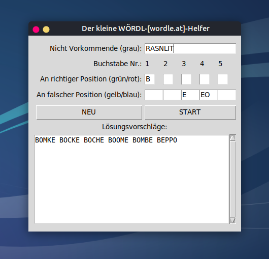

# Der kleine WÖRDL-Helfer

Diese kleine Python3-Tk-Applikation hilft beim Finden von möglichen Lösungen von [WÖRDL-Rätseln](https://wordle.at/), z. B. auf [https://wordle.at](https://wordle.at/) (deutsche [Wordle](https://de.wikipedia.org/wiki/Wordle)-Rätsel mit Ä=AE, Ö=OE, Ü=UE und ß=SS).

Die Installation erfolgt in einem Verzeichnis Ihrer Wahl. Voraussetzung ist ein installiertes [Python](https://www.python.org/) 3.8+ inkl. [tkinter](https://docs.python.org/3/library/tkinter.html). 

Starten Sie die Applikation mit

		python3 main.py

Geben Sie alle grauen (nicht vorkommenden) Buchstaben, die bereits bekannten grünen oder roten Buchstaben der Lösung und die gelben oder blauen Buchstaben, die an falscher Position sind, ein.

Klicken Sie *START* oder drücken Sie einfach die *ENTER*-Taste.

Es werden Ihnen mögliche Lösungen in absteigender Wahrscheinlichkeit angezeigt.

Viel Spaß mit dem kleinen *WÖRDL-Helfer*.

---

# The little WÖRDL helper

This small Python3-Tk application helps to find possible solutions of [WÖRDL puzzles](https://wordle.at/), e.g. on [https://wordle.at](https://wordle.at/) (German [Wordle](https://en.wikipedia.org/wiki/Wordle) puzzles with Ä=AE, Ö =OE, Ü=UE and ß=SS).

The installation takes place in a directory of your choice. An installed [Python](https://www.python.org/) 3.8+ with [tkinter](https://docs.python.org/3/library/tkinter.html) is required.

Start the application with

		python3 main.py

Enter all the gray (non-existent) letters, the green or red letters of the solution you already know, and the yellow or blue letters that are in the wrong position.

Click *START* or simply press the *ENTER* key.

Possible solutions are displayed in descending order of probability.

Have fun with the little *WÖRDL helper*.

---

**Lizenz/License: Public Domain** 

This is free and unencumbered software released into the public domain.

Anyone is free to copy, modify, publish, use, compile, sell, or
distribute this software, either in source code form or as a compiled
binary, for any purpose, commercial or non-commercial, and by any
means.

In jurisdictions that recognize copyright laws, the author or authors
of this software dedicate any and all copyright interest in the
software to the public domain. We make this dedication for the benefit
of the public at large and to the detriment of our heirs and
successors. We intend this dedication to be an overt act of
relinquishment in perpetuity of all present and future rights to this
software under copyright law.

THE SOFTWARE IS PROVIDED "AS IS", WITHOUT WARRANTY OF ANY KIND,
EXPRESS OR IMPLIED, INCLUDING BUT NOT LIMITED TO THE WARRANTIES OF
MERCHANTABILITY, FITNESS FOR A PARTICULAR PURPOSE AND NONINFRINGEMENT.
IN NO EVENT SHALL THE AUTHORS BE LIABLE FOR ANY CLAIM, DAMAGES OR
OTHER LIABILITY, WHETHER IN AN ACTION OF CONTRACT, TORT OR OTHERWISE,
ARISING FROM, OUT OF OR IN CONNECTION WITH THE SOFTWARE OR THE USE OR
OTHER DEALINGS IN THE SOFTWARE.

For more information, please refer to <http://unlicense.org/>

